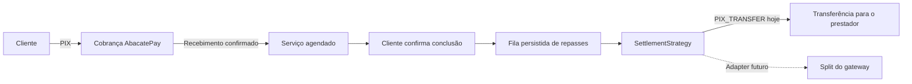

# Pagamentos e repasses com AbacatePay

## Decisão e fluxo

O gateway escolhido é **AbacatePay**. O TaskGo cobra o cliente via PIX e transfere
a parcela do prestador por PIX para terceiros após a confirmação da conclusão pelo
cliente. A comissão continua calculada por serviço, categoria ou configuração.
As taxas cobradas pelo gateway não são subtraídas automaticamente da parcela do
prestador; precisam ser cobertas pelo saldo da plataforma.



A confirmação do serviço e a criação da intenção de repasse ocorrem na mesma
transação de banco. A confirmação não significa que o prestador já recebeu.
`PAYMENT_RELEASED` é registrado somente após confirmação da transferência pelo
provedor. O estado de recebimento do cliente permanece separado do estado do repasse.

## Limites entre componentes

- `PaymentGateway`: contrato da cobrança e das operações financeiras externas.
- `AbacatePayService`: adapter REST v2 com autenticação Bearer, timeout, validação
  de respostas e sem retentativa automática de operações de escrita.
- `SettlementStrategy`: prepara a cobrança, libera e concilia a parcela do prestador.
- `PixTransferStrategy`: implementa o repasse com `/pix/send` e consulta `/pix/get`.
- `SettlementStrategies`: escolhe a estratégia para novos pagamentos e resolve a
  estratégia persistida nos pagamentos existentes.
- `SettlementService`: consome a fila a cada 30 segundos, com exclusão concorrente
  no PostgreSQL. Cada réplica pode executar o worker.

O adapter usa os endpoints documentados, sem dependência do pacote Node.js.
A adoção futura do SDK oficial fica restrita ao adapter, preservando o domínio.

## Preparação para split

Cada pagamento registra `provider`, `settlementStrategy`, comissão, valores e
uma cópia da chave de destino. Cada repasse também registra a estratégia, valor,
destino, identificador externo e resultado. Alterar a chave do perfil não muda um
pagamento existente.

Quando houver um contrato oficial de split disponível:

1. Implementar outra `SettlementStrategy`, incluindo a preparação dos recebedores
   na criação da cobrança e a consulta/liberação conforme as capacidades reais.
2. Acrescentar ao contrato do gateway os dados de split que a API exigir e adaptar
   o cadastro de recebedores. A API futura ainda não pode ser presumida.
3. Registrar a nova implementação em `SettlementStrategies.resolve` e selecioná-la
   em `active()` **somente para novos pagamentos**, após homologação.
4. Manter `PIX_TRANSFER` disponível até liquidar todos os pagamentos antigos.
5. Executar os mesmos testes de conservação de valores, duplicidade, falhas,
   disputa e conciliação. Split não deve disparar um PIX adicional.

As regras de comissão, confirmação e a fila permanecem independentes do mecanismo
utilizado. Não é necessário reescrever o fluxo dos pedidos; trocar apenas uma flag
antes de implementar e homologar o adapter não seria suficiente.

## Configuração e rollout

Aplicar a migration `20260919180000_abacatepay_settlement` antes de subir o backend
novo e gerar o Prisma Client. A migration preserva pagamentos antigos como
`PAGARME` e marca sua estratégia como `LEGACY_SPLIT`; apenas os defaults para novos
registros passam a ser AbacatePay. Tentativas antigas também mantêm o provedor.

Variáveis exclusivas do backend:

```dotenv
ABACATEPAY_API_KEY=
ABACATEPAY_WEBHOOK_SECRET=
ABACATEPAY_DEV_MODE=true
PAYMENTS_SIMULATION=true
DEFAULT_PLATFORM_FEE_PCT=0.12
```

- Simulação local (`PAYMENTS_SIMULATION=true`) não envia dinheiro nem usa a API.
- Sandbox do AbacatePay: `PAYMENTS_SIMULATION=false`, `ABACATEPAY_DEV_MODE=true`
  e chave de desenvolvimento da conta.
- Produção: ambas as flags devem ser `false`; credenciais e webhook são obrigatórios.
- O worker deve permanecer ativo em pelo menos uma instância da API.
- Confirmar na conta as permissões para cobrar, consultar, reembolsar e transferir,
  além de saldo suficiente para o valor do prestador e as taxas.

Cadastrar webhook v2 HTTPS em `/payments/webhook/abacatepay`. A API valida
`webhookSecret` na query e `X-Webhook-Signature` (HMAC-SHA256 sobre o corpo original,
conforme a chave publicada pelo AbacatePay). Registrar os eventos
`transparent.completed`, `transparent.refunded`, `transparent.disputed`,
`transparent.lost`, `transfer.completed` e `transfer.failed` disponíveis na conta.
Não registrar query strings desse endpoint em proxies ou observabilidade.

O endpoint antigo `/payments/webhook/pagarme` não está registrado. Os artefatos
históricos do Pagar.me não estão conectados ao módulo em execução. Pagamentos
antigos com movimentação precisam de conciliação operacional no provedor original;
nunca são enviados ao AbacatePay. Resolver esse estoque antes do corte operacional.

## Prestadores

Na área do perfil, **Recebimentos PIX** abre `/provider/recebimentos`, com cadastro
da chave e os 50 repasses mais recentes. As rotas autenticadas são:

- `GET/PUT /payments/payout-destination`: chave do próprio prestador.
- `GET /payments/payout-destination/settlements`: estado e valor dos próprios repasses.

Tipos aceitos: CPF, CNPJ, telefone, e-mail e chave aleatória. O cadastro valida o
formato, mas não representa verificação bancária de titularidade. O prestador deve
informar uma chave sua. As chaves não são devolvidas nas listagens de pedidos.
O valor mínimo de repasse é R$ 1,00; cobranças que resultariam em repasse menor são
recusadas antes de cobrar o cliente. Cartão continua desabilitado.

## Falhas e conciliação

`READY → SUBMITTING → PENDING → SUCCEEDED` é o caminho normal. `FAILED` indica
resultado de falha no gateway; `BLOCKED` indica que pagamento, confirmação ou
disputa impede o envio. A interface identifica esses casos para suporte.

A marca `SUBMITTING` é confirmada no banco **antes** da chamada externa. Mesmo que
a resposta se perca, outra instância apenas consulta o mesmo `externalId`; não
reenvia. Esse comportamento também cobre reinicialização do processo. Se houver
queda entre a marca e a chamada, a operação pode permanecer sem resultado: é uma
situação de revisão operacional, não autorização para enviar novamente.

O suporte deve consultar `externalId` e o histórico da conta. Não apagar registros,
limpar marcas de envio ou alterar identificadores para forçar uma nova tentativa.
Uma resposta 404 isolada não comprova que o provedor jamais executou a operação.
Não há reenvio administrativo automático nesta implementação.

A criação da cobrança também usa uma marca persistida. Retentativas consultam a
cobrança pela referência imutável, sem presumir idempotência de `externalId`.
O GET do pagamento tenta recuperar uma criação pendente já enviada. O reembolso
possui sua própria marca; aceite do pedido de estorno não é confirmação do estorno.
PIX ainda pendente aguarda expiração ou recebimento para cancelamento conciliado;
não é cancelado apenas no banco enquanto o QR Code pode ser pago.

Disputas e notificações de reembolso bloqueiam novos repasses, inclusive quando o
status de cobrança ainda estiver atrasado. Uma transferência já enviada exige
tratamento operacional; não se presume que seja reversível.

## Homologação e fontes

Os testes locais usam contratos simulados do gateway e PostgreSQL real isolado.
Não houve cobrança, transferência ou homologação na conta real do AbacatePay.
Validar sandbox, assinatura do webhook, expiração, taxas e respostas reais antes
de habilitar a operação em produção.

Referências oficiais consultadas:

- [SDK Node.js](https://docs.abacatepay.com/pages/sdks/nodejs)
- [Criar PIX](https://docs.abacatepay.com/pages/transparents/create)
- [Listar e filtrar cobranças](https://docs.abacatepay.com/pages/transparents/list)
- [Consultar status](https://docs.abacatepay.com/pages/transparents/check)
- [Reembolso](https://docs.abacatepay.com/pages/transparents/refund)
- [Enviar PIX a terceiros](https://docs.abacatepay.com/pages/pix/create)
- [Consultar transferência](https://docs.abacatepay.com/pages/pix/get)
- [Segurança dos webhooks](https://docs.abacatepay.com/pages/webhooks/security)
- [Disponibilidade futura do split](https://www.abacatepay.com/para/marketplaces)
